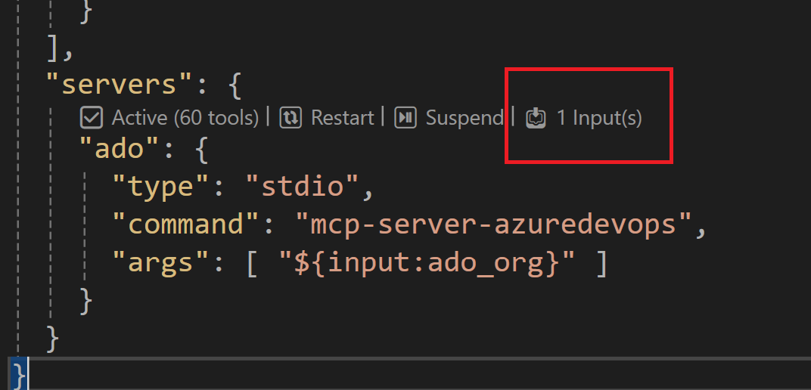
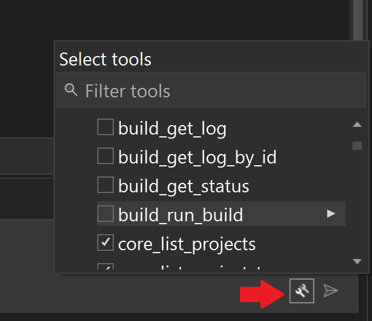
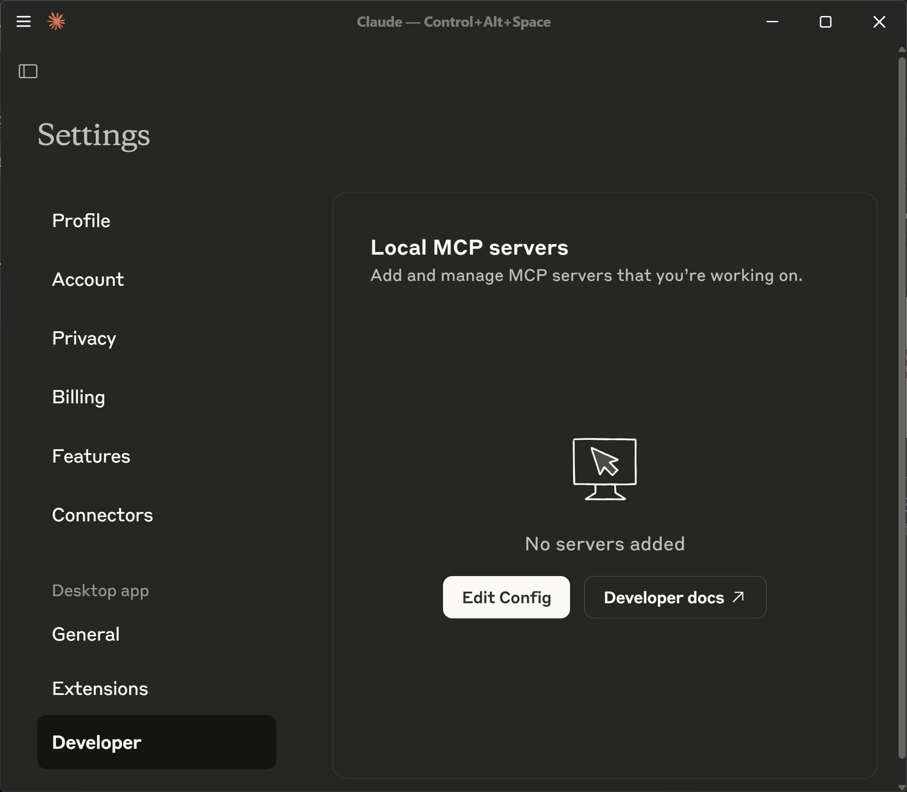
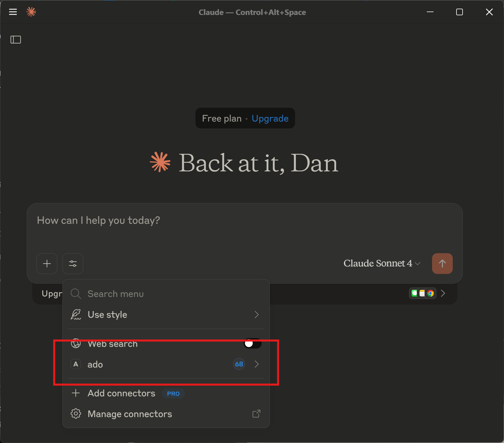
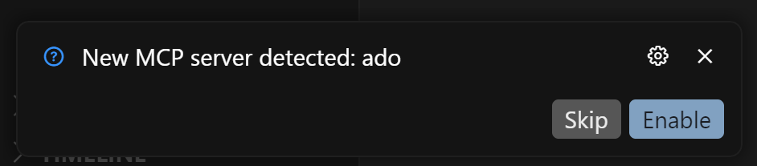

# 🚀 Getting Started with Azure DevOps MCP Server

This guide will help you get started with the Azure DevOps MCP Server in different environments.

- [Prerequisites](#-prerequisites)
- [Authentication Methods](#-authentication-methods)
- [Getting started with Visual Studio Code & GitHub Copilot](#️-visual-studio-code--github-copilot)
- [Getting started with Visual Studio 2022 & GitHub Copilot](#%EF%B8%8F-visual-studio-2022--github-copilot)
- [Getting started with GitHub Copilot CLI](#-using-mcp-server-with-github-copilot-cli)
- [Getting started with Claude Code](#-using-mcp-server-with-claude-code)
- [Getting started with Claude Desktop](#️-using-mcp-server-with-claude-desktop)
- [Getting started with Cursor](#-using-mcp-server-with-cursor)
- [Getting started with Opencode](#-using-mcp-server-with-opencode)
- [Getting started with Kilocode](#-using-mcp-server-with-kilocode)
- [Optimizing Your Experience](#-optimizing-your-experience)

## 🕐 Prerequisites

For the best experience, use Visual Studio Code and GitHub Copilot.

Before you begin, make sure you have:

### For Visual Studio Code

1. Install [VS Code](https://code.visualstudio.com/download) or [VS Code Insiders](https://code.visualstudio.com/insiders)
2. Install [Node.js](https://nodejs.org/en/download) 20+
3. Open VS Code in an empty folder

### For Visual Studio 2022

1. Install [VS Studio 2022 version 17.14](https://learn.microsoft.com/en-us/visualstudio/releases/2022/release-history) or later
2. Open a project in Visual Studio

## 🔐 Authentication Methods

The Azure DevOps MCP Server supports several authentication methods. Pass the desired method via the `--authentication` (`-a`) flag in your `mcp.json` configuration.

| Method                        | Flag value    | Environment variable    | Best for                                              |
| ----------------------------- | ------------- | ----------------------- | ----------------------------------------------------- |
| Interactive (default)         | `interactive` | —                       | Local development, first-time setup                   |
| Azure CLI                     | `azcli`       | —                       | Workstations already signed in with `az login`        |
| Environment variable (bearer) | `envvar`      | `ADO_MCP_AUTH_TOKEN`    | CI/CD, automation                                     |
| Personal Access Token         | `pat`         | `PERSONAL_ACCESS_TOKEN` | CI/CD, service accounts, non-interactive environments |

### 🔵 Interactive (Default)

Opens a browser window for Microsoft account login. No extra configuration needed — this is the default when `--authentication` is omitted.

```json
{
  "servers": {
    "ado": {
      "type": "stdio",
      "command": "npx",
      "args": ["-y", "@azure-devops/mcp", "<your-org>"]
    }
  }
}
```

### 🟢 Azure CLI (`azcli`)

Uses the token from an active `az login` session. Requires the [Azure CLI](https://learn.microsoft.com/en-us/cli/azure/install-azure-cli) to be installed and signed in.

```json
{
  "servers": {
    "ado": {
      "type": "stdio",
      "command": "npx",
      "args": ["-y", "@azure-devops/mcp", "<your-org>", "--authentication", "azcli"]
    }
  }
}
```

### 🟡 Environment Variable — Bearer Token (`envvar`)

Reads a raw bearer token from the `ADO_MCP_AUTH_TOKEN` environment variable. Useful when another tool or pipeline injects the token at runtime.

1. Set the environment variable:

   ```bash
   export ADO_MCP_AUTH_TOKEN="<your-azure-devops-bearer-token>"
   ```

2. Configure `.vscode/mcp.json`:

   ```json
   {
     "inputs": [
       {
         "id": "ado_org",
         "type": "promptString",
         "description": "Azure DevOps organization name (e.g. 'contoso')"
       }
     ],
     "servers": {
       "ado": {
         "type": "stdio",
         "command": "npx",
         "args": ["-y", "@azure-devops/mcp", "${input:ado_org}", "--authentication", "envvar"]
       }
     }
   }
   ```

### 🔑 Personal Access Token (`pat`)

Authenticates using an Azure DevOps [Personal Access Token (PAT)](https://learn.microsoft.com/en-us/azure/devops/organizations/accounts/use-personal-access-tokens-to-authenticate). The token must be stored in the `PERSONAL_ACCESS_TOKEN` environment variable as a **base64-encoded** string.

#### PAT format

The value stored in `PERSONAL_ACCESS_TOKEN` must be the base64 encoding of `<email>:<pat>`, where `<email>` is any non-empty string (the Azure DevOps API only uses the token portion) and `<pat>` is the raw PAT you copied from Azure DevOps.

#### `.vscode/mcp.json` configuration

```json
{
  "inputs": [
    {
      "id": "ado_org",
      "type": "promptString",
      "description": "Azure DevOps organization name (e.g. 'contoso')"
    }
  ],
  "servers": {
    "ado": {
      "type": "stdio",
      "command": "npx",
      "args": ["-y", "@azure-devops/mcp", "${input:ado_org}", "--authentication", "pat"],
      "env": {
        "PERSONAL_ACCESS_TOKEN": "<base64encoded email:pat>"
      }
    }
  }
}
```

> **Security note:** Avoid hard-coding the PAT value directly in `mcp.json` when committing to source control. Prefer injecting it via an environment variable set outside the config file, or use a secrets manager.

## 🍕 Installation Options

### ➡️ Visual Studio Code & GitHub Copilot

For the best experience, use Visual Studio Code and GitHub Copilot.

#### 🧨 Install from Public Feed (Recommended)

This installation method is the easiest for all users of Visual Studio Code.

🎥 [Watch this quick start video to get up and running in under two minutes!](https://youtu.be/EUmFM6qXoYk)

##### Steps

In your project, add a `.vscode\mcp.json` file with the following content:

```json
{
  "inputs": [
    {
      "id": "ado_org",
      "type": "promptString",
      "description": "Azure DevOps organization name  (e.g. 'contoso')"
    }
  ],
  "servers": {
    "ado": {
      "type": "stdio",
      "command": "npx",
      "args": ["-y", "@azure-devops/mcp", "${input:ado_org}"]
    }
  }
}
```

Save the file, then click 'Start'.


In chat, switch to [Agent Mode](https://code.visualstudio.com/blogs/2025/02/24/introducing-copilot-agent-mode).

Click "Select Tools" and choose the available tools.


> 💥 We strongly recommend creating a `.github\copilot-instructions.md` in your project and copying the contents from this [copilot-instructions.md](../.github/copilot-instructions.md) file. This will enhance your experience using the Azure DevOps MCP Server with GitHub Copilot Chat.

##### Start using it

1. Open GitHub Copilot in VS Code and switch to Agent mode.
2. Start the Azure DevOps MCP Server.
3. The server appears in the tools list.
4. Try prompts like "List ADO projects".

##### Using Token Authentication via Environment Variables

For automated scenarios or when you want to use a token stored in an environment variable, you can use the `envvar` authentication type:

1. **Set your token in the ADO_MCP_AUTH_TOKEN environment variable:**

   ```bash
   export ADO_MCP_AUTH_TOKEN="your-azure-devops-token"
   ```

2. **Update your `.vscode/mcp.json` to use token authentication:**
   ```json
   {
     "inputs": [
       {
         "id": "ado_org",
         "type": "promptString",
         "description": "Azure DevOps organization name (e.g. 'contoso')"
       }
     ],
     "servers": {
       "ado": {
         "type": "stdio",
         "command": "npx",
         "args": ["-y", "@azure-devops/mcp", "${input:ado_org}", "--authentication", "envvar"]
       }
     }
   }
   ```

This approach is particularly useful for CI/pipeline scenarios or when you want to avoid interactive authentication and use another credential source.

#### 🛠️ Install from Source (Dev Mode)

This installation method is recommended for advanced users and contributors who want immediate access to the latest updates from the main branch. It is ideal if you are developing new tools, enhancing existing features, or maintaining a custom fork.

> **Note:** For most users, installing from the public feed is simpler and preferred. Use the source installation only if you need the latest changes or are actively contributing to the project.

##### Steps

Clone the repository.

Install dependencies:

```sh
npm install
```

Edit or add `.vscode/mcp.json`:

```json
{
  "inputs": [
    {
      "id": "ado_org",
      "type": "promptString",
      "description": "Azure DevOps organization's name  (e.g. 'contoso')"
    }
  ],
  "servers": {
    "ado": {
      "type": "stdio",
      "command": "mcp-server-azuredevops",
      "args": ["${input:ado_org}"]
    }
  }
}
```

Start the Azure DevOps MCP Server.


In chat, switch to [Agent Mode](https://code.visualstudio.com/blogs/2025/02/24/introducing-copilot-agent-mode).

Click "Select Tools" and choose the available tools.


> 💥 We strongly recommend creating a `.github\copilot-instructions.md` in your project and copying the contents from this [copilot-instructions.md](../.github/copilot-instructions.md) file. This will help you get the best experience using the Azure DevOps MCP Server in GitHub Copilot Chat.

### ➡️ Visual Studio 2022 & GitHub Copilot

#### 🧨 Install from Public Feed (Recommended)

This installation method is the easiest for all users of Visual Studio 2022.

🎥 [Watch this quick start video to get up and running in under two minutes!](https://youtu.be/nz_Gn-WL7j0)

##### Steps

Add a `.mcp.json` file to the solution folder with the following content:

```json
{
  "inputs": [
    {
      "id": "ado_org",
      "type": "promptString",
      "description": "Azure DevOps organization name  (e.g. 'contoso')"
    }
  ],
  "servers": {
    "ado": {
      "type": "stdio",
      "command": "npx",
      "args": ["-y", "@azure-devops/mcp", "${input:ado_org}"]
    }
  }
}
```

Save the file.

Add your organization name by clicking on the `input` option.



Open Copilot chat and switch to [Agent Mode](https://learn.microsoft.com/en-us/visualstudio/ide/copilot-agent-mode?view=vs-2022).

Click the "Tools" icon and choose the available tools.



> 💥 We strongly recommend creating a `.github\copilot-instructions.md` in your project and copying the contents from this [copilot-instructions.md](../.github/copilot-instructions.md) file. This will enhance your experience using the Azure DevOps MCP Server with GitHub Copilot Chat.

##### Start using it

> _Prerequisites:_ Visual Studio 2022 v17.14+, Agent mode enabled in Tools > Options > GitHub > Copilot > Copilot Chat.

1. Switch to Agent mode in the Copilot Chat window.
2. Enter your Azure DevOps organization name.
3. Select desired `ado` tools.
4. Try prompts like "List ADO projects".

For more details, see [Visual Studio MCP Servers documentation](https://learn.microsoft.com/en-us/visualstudio/ide/mcp-servers?view=vs-2022) and the [Getting Started Video](https://www.youtube.com/watch?v=oPFecZHBCkg).

### 💻 Using MCP Server with GitHub Copilot CLI

Use the Copilot CLI to interactively add the MCP server:

```bash
/mcp add
```

Alternatively, create or edit the configuration file `~/.copilot/mcp-config.json` and add:

```json
{
  "mcpServers": {
    "ado": {
      "command": "npx",
      "args": ["-y", "@azure-devops/mcp", "{Contoso}"],
      "tools": ["*"]
    }
  }
}
```

Replace `{Contoso}` with your Azure DevOps organization name.

For more information, see the [Copilot CLI documentation](https://docs.github.com/en/copilot/concepts/agents/about-copilot-cli).

### 🤖 Using MCP Server with Claude Code

See https://docs.anthropic.com/en/docs/claude-code/mcp for general guidance on adding MCP Server to Claude Code experience.

For the Azure DevOps MCP Server, use the following command:

```bash
claude mcp add azure-devops -- npx -y @azure-devops/mcp Contoso
```

Replace `Contoso` with your own organization name

### ✴️ Using MCP Server with Claude Desktop

Open Claude Desktop and navigate to **File > Settings > Developer**. Click **Edit Config**.



Open the configuration file in your preferred editor (e.g., VS Code) and add the following JSON:

```json
{
  "mcpServers": {
    "ado": {
      "command": "npx",
      "args": ["-y", "@azure-devops/mcp", "{Contoso}"]
    }
  }
}
```

Replace `{Contoso}` with your Azure DevOps organization name. Save the file and perform a hard restart of the Claude app.

Start a new chat, then click the **Search and Tools** icon. The `ado` toolset should now be available.



You’re ready to start using the Azure DevOps MCP Server in Claude Desktop. Try a simple request such as: `get list of ado projects`.

For additional guidance on Claude Desktop, see the [Quickstart](https://modelcontextprotocol.io/quickstart/user#installing-the-filesystem-server).

### 🍇 Using MCP Server with Cursor

To integrate the Azure DevOps MCP Server with Cursor, create a `.cursor\mcp.json` file and add your Azure DevOps organization to the `mcpServers` list.

```json
{
  "mcpServers": {
    "ado": {
      "command": "npx",
      "args": ["-y", "@azure-devops/mcp", "{Contoso}"]
    }
  }
}
```

Replace `{Contoso}` with your actual Azure DevOps organization name.

Save the file, and when Cursor detects the MCP Server, click **Enable**.



#### Start the Azure DevOps MCP Server

Open the terminal and start the MCP Server with:

```bash
npx -y @azure-devops/mcp {Contoso}
```

Replace `Contoso` with your Azure DevOps organization.

You can now use the Azure DevOps MCP Server tools directly in chat.

📽️ [Azure DevOps MCP Server: Getting started with Cursor](https://youtu.be/550VPTnjYRg)

### 🟢 Using MCP Server with Opencode

Add the Azure DevOps MCP server to your Opencode config file.

**Config file location:**

- macOS / Linux: `~/.config/opencode/opencode.json`

Add the `azure-devops` entry under the `mcp` key:

```json
{
  "$schema": "https://opencode.ai/config.json",
  "mcp": {
    "azure-devops": {
      "type": "local",
      "command": ["npx", "-y", "@azure-devops/mcp", "<your-org>"],
      "enabled": true
    }
  }
}
```

Replace `<your-org>` with your Azure DevOps organization name (e.g. `contoso`).

> **Note:** On first use, Opencode will trigger browser-based Microsoft account login.

> **Tip:** Limit loaded tools using domain filtering by appending `-d` flags to the command:
>
> ```json
> "command": ["npx", "-y", "@azure-devops/mcp", "<your-org>", "-d", "core", "work", "work-items"]
> ```
>
> Available domains: `core`, `work`, `work-items`, `repositories`, `wiki`, `pipelines`, `search`, `test-plans`, `advanced-security`

For more on Opencode MCP configuration, see the [Opencode MCP docs](https://opencode.ai/docs/mcp-servers/).

### ⬛ Using MCP Server with Kilocode

Kilocode supports MCP servers at two levels — **global** (all workspaces) or **project** (repo-specific).

#### Option A — Global config

1. Open the Kilocode pane → click the ⚙️ icon → **Agent Behaviour** → **MCP Servers**
2. Click **Edit Global MCP** to open `mcp_settings.json`
3. Add the `azure-devops` entry:

```json
{
  "mcpServers": {
    "azure-devops": {
      "command": "npx",
      "args": ["-y", "@azure-devops/mcp", "<your-org>"]
    }
  }
}
```

#### Option B — Project config

Create `.kilocode/mcp.json` in your project root with the same content as above. This file can be committed to version control to share the setup with your team.

> **Windows users:** Wrap the command for the Windows Command Prompt:
>
> ```json
> {
>   "mcpServers": {
>     "azure-devops": {
>       "command": "cmd",
>       "args": ["/c", "npx", "-y", "@azure-devops/mcp", "<your-org>"]
>     }
>   }
> }
> ```

Replace `<your-org>` with your Azure DevOps organization name. On first use, a browser window will open for Microsoft account login.

For more on Kilocode MCP configuration, see the [Kilocode MCP docs](https://kilo.ai/docs/automate/mcp/using-in-kilo-code).
